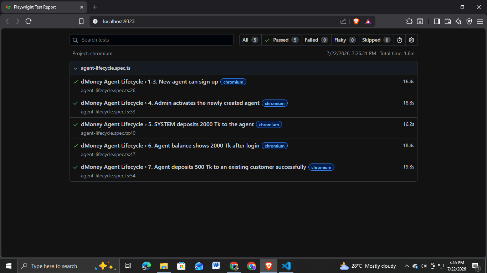

# dMoney Agent Lifecycle — Playwright + TypeScript Automation

Automated end-to-end test for the dMoney QA practice platform
(`https://dmoneyportal.roadtocareer.net`), covering a full Agent lifecycle:
signup → admin activation → SYSTEM funding → agent balance check → agent
deposit to a customer.

**Road to SDET — Batch 18 — Automation Assignment**

## Test Flow

1. Visit `https://dmoneyportal.roadtocareer.net`
2. Click **Sign Up**
3. Register a new account with the **Agent** role
4. Log in as **Admin** and activate the newly created agent
5. Log in as **SYSTEM** and deposit **2000 Tk** to the agent
6. Log in as the **agent** and assert the balance shows **2000 Tk**
7. Deposit **500 Tk** to an existing customer and assert the transaction succeeds

## Why this needed an email-OTP solution

The platform requires OTP verification (sent to a real Gmail inbox) during
Agent/Customer/Merchant signup and login. `utils/gmail-otp-reader.ts`
connects to Gmail over IMAP and reads the code straight out of the inbox,
so the whole flow runs unattended. See that file's comments for the full
reasoning.

## Tech Stack

- [Playwright](https://playwright.dev/) + TypeScript
- [imapflow](https://imapflow.com/) + [mailparser](https://nodemailer.com/extras/mailparser/) for automated OTP retrieval
- GitHub Actions for CI/CD

## Project Structure

```
├── .github/workflows/playwright.yml   # CI pipeline
├── services/                          # OOP layer — one class per role/concern
│   ├── base.service.ts                #   shared Playwright actions
│   ├── auth.service.ts                #   signup + login (any role, auto OTP)
│   ├── admin.service.ts               #   agent search + activation
│   ├── system.service.ts              #   SYSTEM → agent deposit
│   └── agent.service.ts               #   balance check + agent → customer deposit
├── tests/
│   └── agent-lifecycle.spec.ts        # the 7-step serial test chain
├── utils/
│   ├── env.ts                         # typed, validated environment config
│   ├── test-data.ts                   # unique agent data generator per run
│   └── gmail-otp-reader.ts            # IMAP-based OTP retrieval
├── .env.example
├── playwright.config.ts
└── tsconfig.json
```

## Setup

1. Clone the repo and install dependencies:
   ```bash
   npm install
   npx playwright install --with-deps chromium
   ```

2. Copy `.env.example` to `.env` and fill in real values:
   ```bash
   cp .env.example .env
   ```

   You'll need a Gmail **App Password** (not your normal password) for
   `GMAIL_APP_PASSWORD` — generate one at
   [myaccount.google.com/apppasswords](https://myaccount.google.com/apppasswords)
   (requires 2-Step Verification enabled first).

3. Run the tests:
   ```bash
   npm test
   ```
   Or with a visible browser window:
   ```bash
   npm run test:headed
   ```

4. View the HTML report:
   ```bash
   npm run report
   ```

 ## Playwright Report

The project generates an HTML report after every test execution.



## CI/CD

Every push/PR to `main` runs the full suite via GitHub Actions
(`.github/workflows/playwright.yml`) and uploads the HTML report as a build
artifact. Add all the same values from your `.env` as **repo secrets** under
**Settings → Secrets and variables → Actions** before pushing.

## Implementation notes (things that weren't obvious upfront)

These were all found by running against the live site and reading real
Playwright error snapshots — worth knowing if you extend this suite:

- **The register page has two "Sign Up" links** (header nav + hero CTA)
  pointing to the same place, so `signup()` navigates straight to
  `/register` instead of clicking either one.
- **"Account Type (Role)" and "Account Status" aren't linked to their
  inputs via `<label for>`/`aria-labelledby`** — only visually adjacent
  text. `getByLabel()` can't find them; both are selected by role/position
  instead (see `selectRole()` in `auth.service.ts` and `activateAgent()`
  in `admin.service.ts`).
- **MUI buttons apply `text-transform: uppercase` visually**, but the real
  DOM text stays as authored (e.g. "View", not "VIEW"). Don't trust visual
  casing from a screenshot for exact-match locators — use `exact: false`
  (which is also case-insensitive) unless you've confirmed the real text.
- **Agent activation has no direct "Activate" button** — the real flow is
  User List → View → Edit User → Account Status dropdown → Active → Save
  Changes.
- **The User List isn't reliably sorted for a fresh agent** — this is a
  shared practice platform used by many students concurrently, so a
  just-registered agent can get pushed off page 1 by other students'
  activity between signup and activation. `activateAgent()` uses the
  platform's real "Search by Email" feature instead of relying on sort
  order or pagination.
- **The User List page has two comboboxes once pagination appears**
  ("Search Type" and "Rows per page") — locators need to disambiguate
  between them (`.first()`, or filtering by current visible text).

## Known limitations

- OTP retrieval assumes emails from dMoney reliably contain the phrase
  `is:` immediately before the 4-digit code, with a bare-4-digit fallback
  regex if that phrase isn't found. If the email template changes, update
  `GmailOtpReader.extractOtp()`.
- Because this depends on real email delivery timing, a fetched OTP can
  occasionally already be expired/superseded by a newer one by the time
  it's submitted. `resolveOtpIfPresent()` in `auth.service.ts` handles this
  automatically — if the site responds "Invalid OTP", it fetches a fresh
  code (searching only from that failed attempt forward) and retries, up
  to 3 attempts, before failing the test.
- The global Playwright test timeout (180s) is intentionally well above
  `GmailOtpReader`'s own polling deadline (60s) so a slow-but-successful
  IMAP poll never gets cut off by the outer test timeout first.
- Verified locally with multiple consecutive full green runs (all 5 steps)
  before relying on it for submission.
- **CI/CD note:** the pipeline is fully configured and correctly automates
  the entire flow (see `.github/workflows/playwright.yml`), but when run
  from GitHub Actions' shared cloud IP ranges, the target platform's
  Cloudflare bot-protection challenges requests to `/admin/*` routes —
  confirmed consistently across multiple CI runs, including with a virtual
  display (Xvfb) in headed mode to rule out headless-browser fingerprinting.
  This is a third-party infrastructure constraint, not a defect in the test
  suite — the same suite passes reliably every time when run locally.
  Confirmed with the course instructor that a correctly configured workflow
  file is sufficient for this submission.

## Author

Niamul Hasan — Road to SDET, Batch 18

## Submission Checklist

- [x] OOP structure (`services/` — one class per role/concern)
- [x] `node_modules/` and `.env` excluded via `.gitignore`
- [x] README documented
- [x] CI/CD pipeline configured (`.github/workflows/playwright.yml`) —
      blocked from producing a green run by the target platform's
      Cloudflare protection on GitHub's shared IPs (documented above);
      confirmed with instructor that a correctly configured workflow is
      sufficient
- [x] Playwright HTML report summary screenshot attached (local run, all
      5 steps passing)